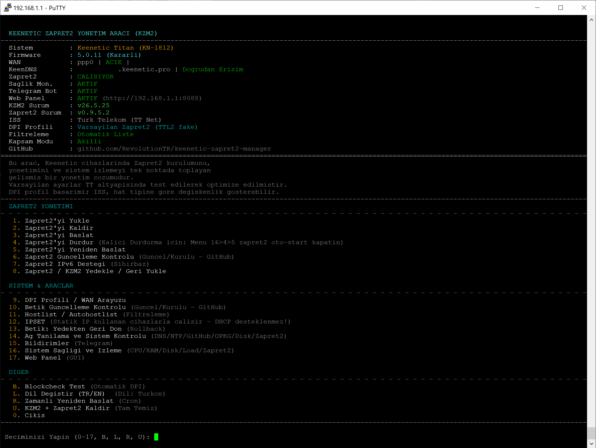
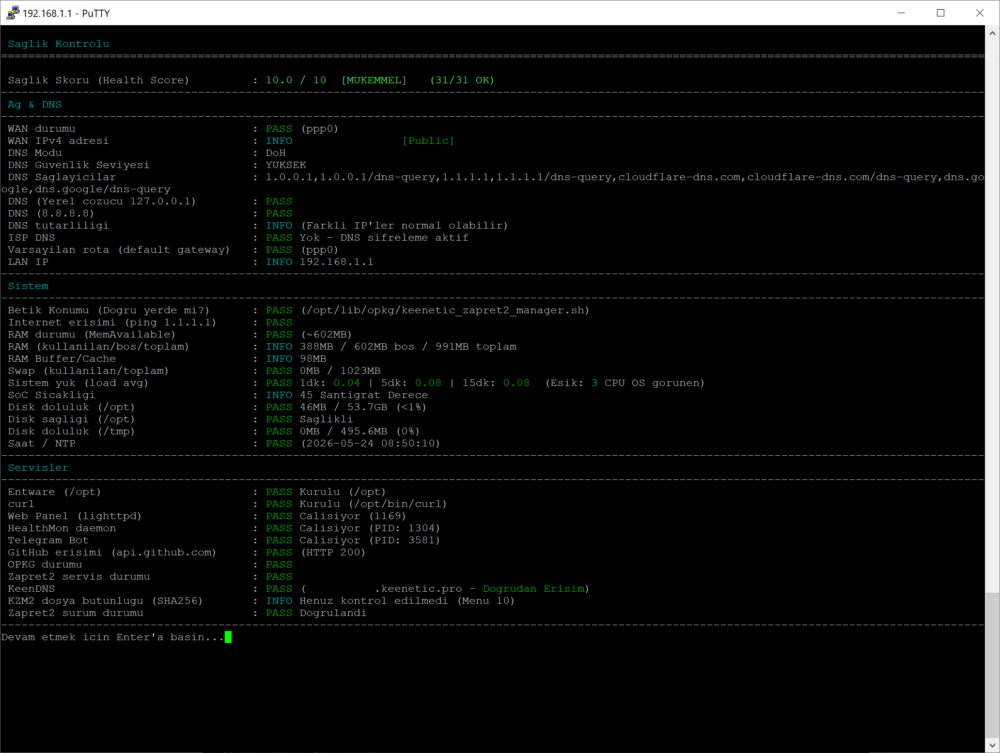
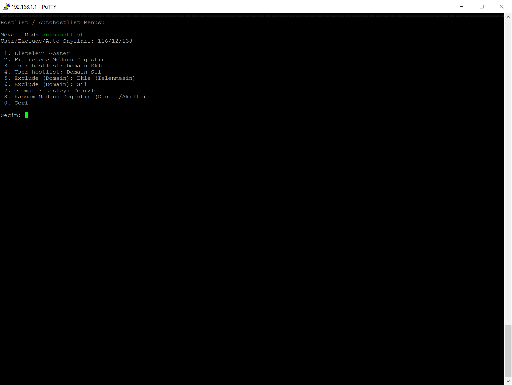
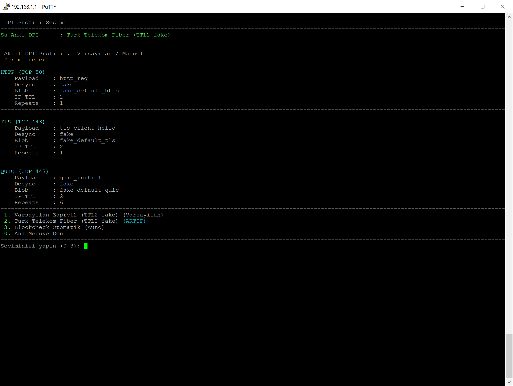
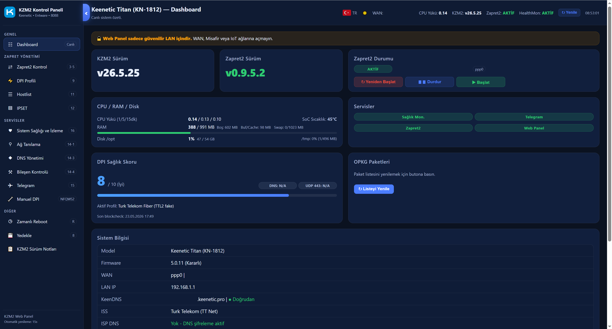
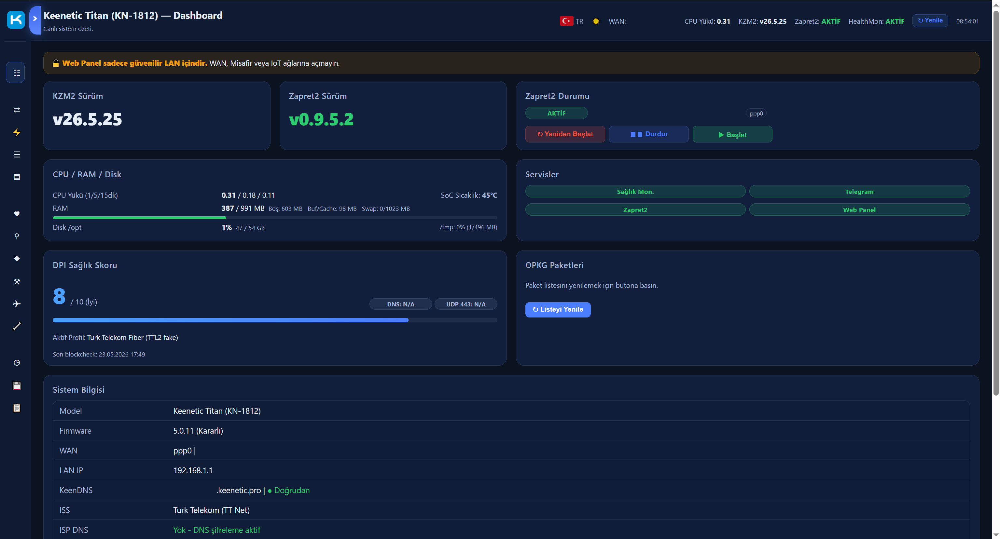
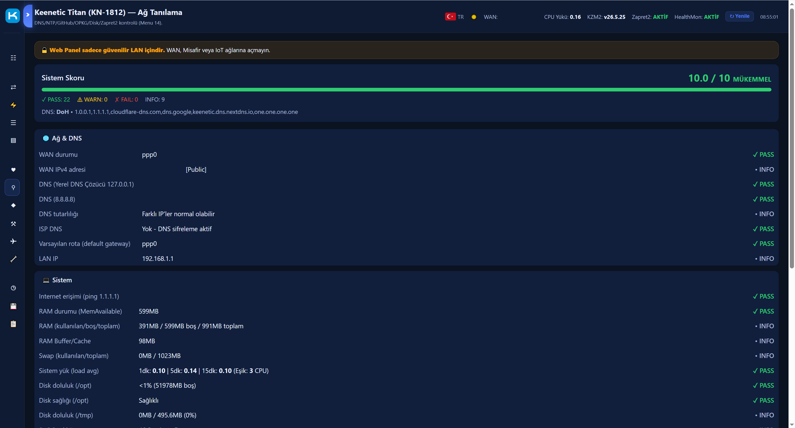
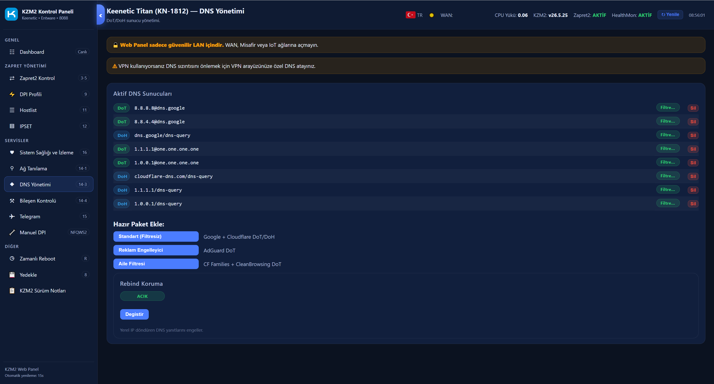
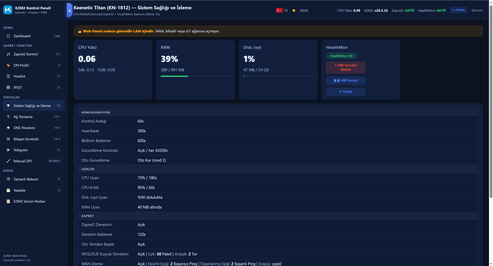
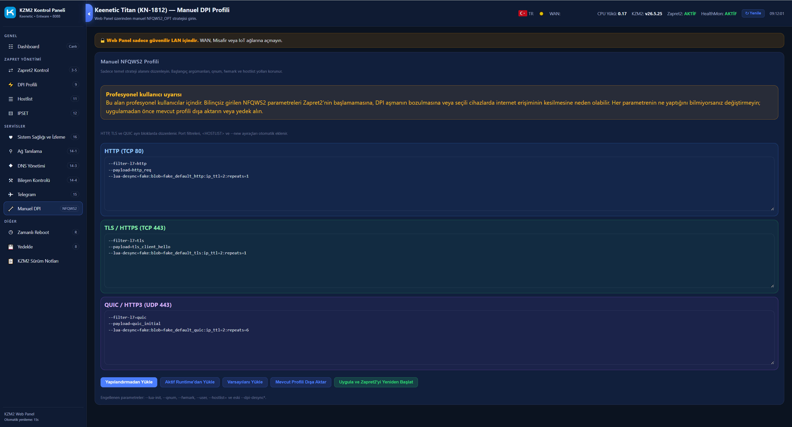

# Keenetic Zapret2 Manager (KZM2)

## 📦 Kurulum ve İndirme

[](https://github.com/RevolutionTR/keenetic-zapret2-manager/stargazers)
[](https://github.com/RevolutionTR/keenetic-zapret2-manager/releases/latest)
<br>
<br>
[](https://github.com/RevolutionTR/keenetic-zapret2-manager/blob/main/docs/sifirdan_kurulum_anlatimi.md)
[](https://github.com/RevolutionTR/keenetic-zapret2-manager/blob/main/docs/kullanim_klavuzu.md)
[](https://github.com/RevolutionTR/keenetic-zapret2-manager/blob/main/docs/telegram.md)
[](https://keenetic.com.tr)
<br>

[](https://github.com/RevolutionTR/keenetic-zapret2-manager)
[](https://github.com/RevolutionTR/keenetic-zapret2-manager)

<br>
<br>









## 🚀 KZM2 WEB UI













> [!WARNING]
> ## 🔒 Web Panel Güvenlik Notu
>
> KZM2 Web Panel yalnızca **güvenilir yerel ağ (Trusted LAN)** üzerinde kullanılmak üzere tasarlanmıştır.
>
> **Önerilmez:**
> - WAN (internet) erişimine açılması
> - Port Forward yapılması
> - Misafir (Guest) ağlarından erişim
> - IoT/VLAN gibi güvenilmeyen segmentlerden erişim
>
> Web Panel; Zapret2 yeniden başlatma, DPI profili değiştirme, hostlist/IPSET yönetimi ve sistem işlemleri gibi **yönetici seviyesinde işlemler** yapabilir.
>
> Bu nedenle yalnızca **ev/ofis içindeki güvenilir yönetim ağı** üzerinden kullanılması önerilir.


## ✅ Test Edilen Keenetic OS Sürümleri

Bu betik aşağıdaki Keenetic OS sürümlerinde test edilmiştir:

- **Keenetic OS 5.0.11**
- **Keenetic OS 4.3.6.4**

> Daha eski Keenetic OS sürümlerinde test edilmemiştir.  
> Eski sürümlerde OPKG/Entware paketleri, iptables/ipset davranışı veya binary uyumluluğu farklı olabilir.

## ✅ Önerilen Kurulum:
KZM2 için Entware/OPKG ortamının `/opt` altında hazır olması gerekir. Bu `/opt`
bağlantısı dahili depolama veya USB sürücü üzerinde olabilir.

- Dahili depolaması yaklaşık 100 MB olan güncel Keenetic modellerinde sadece KZM2/Zapret2 için dahili depolama genellikle yeterlidir.
- Dahili depolaması düşük olan eski modellerde veya ek Entware paketleri, yoğun log, Web Panel/izleme gibi kullanım senaryolarında USB/harici depolama tavsiye edilir.
- KZM2 betiği `/opt/lib/opkg`, Zapret2 dosyaları ise `/opt/zapret2` altında çalışır.

---

## 📖 Proje Hakkında

**Keenetic router/modem'ler için Zapret2 yönetim ve otomasyon betiği**

Bu proje, Zapret2'yin Keenetic cihazlarda **kolay kurulumu**, **DPI profili yönetimi**,  
**IPSET ile istemci seçimi**, **menü tabanlı kullanım** ve  
**GitHub üzerinden sürüm takibi** için hazırlanmıştır.

### DNS Hakkında Önemli Not

Zapret2, DPI (Deep Packet Inspection) tabanlı engellemeleri aşmak için tasarlanmıştır.  
**DNS tabanlı engellemeleri veya ISS DNS manipülasyonunu çözmez.**

Bu nedenle, bazı ISS'lerde Zapret2 kullanılırken:
- DoH (DNS over HTTPS),
- DoT (DNS over TLS),
- veya güvenilir bir üçüncü taraf DNS

kullanılması **şiddetle tavsiye edilir**.

ISS DNS sunucuları, engelli alan adları için hatalı IP döndürebilir.  
Bu durumda Zapret2 çalışıyor olsa bile bağlantı kurulamayabilir.

---

## 🚀 Özellikler

### Zapret2 Kurulum ve Yönetimi
- Zapret2 otomatik kurulum ve kaldırma
- Tek menüden tam kurulum / temiz kaldırma
- Zapret2 dosyalarının sistemden güvenli şekilde yönetilmesi

### DPI Profil Yönetimi
- Varsayılan Zapret2 profili: **Turk Telekom Fiber (TTL2 fake)**
- Web Panel üzerinden **HTTP / TLS / QUIC** bölümlerine ayrılmış özel DPI düzenleme
- Blockcheck sonucuna göre otomatik DPI parametresi uygulama
- Geçersiz manuel parametreleri engelleyen **dry-run / syntax doğrulaması**
- Profil değişiminden sonra **otomatik Zapret2 restart**

### IPSET Tabanlı Trafik Kontrolü
- Tüm ağa Zapret2 uygulama (**Global mod**)
- Sadece seçili IP'lere Zapret2 uygulama (**Smart mod**)
- IPSET listesi ile istemci bazlı kontrol

### Hostlist / Autohostlist Sistemi
- DPI algılanan domain'lerin otomatik öğrenilmesi (Autohostlist)
- Manuel domain ekleme / çıkarma (User hostlist)
- Hariç tutulan domain listesi (Exclude)

### IPv6 Desteği
- IPv6 Zapret2 desteği (isteğe bağlı)
- Menüden IPv6 açma / kapatma
- Durum ekranında renkli IPv6 gösterimi

### Yedekleme ve Geri Yükleme
- IPSET altında oluşan `.txt` dosyalarını tek tek yedekleme
- Seçili dosyaları geri yükleme
- Geri yükleme sonrası **otomatik Zapret2 restart**

### Sürüm ve Güncelleme Kontrolleri
- Kurulu Zapret2 sürüm bilgisi
- Manager (betik) sürüm kontrolü (GitHub)
- Güncel sürüm uyarıları

### CLI Kısayollar
- `kzm2`
- `KZM2`
- `keenetic-zapret2`
- Script'i tam path yazmadan çalıştırabilme

### Çok Dilli Arayüz
- Türkçe / İngilizce (TR / EN) dil desteği
- Sözlük tabanlı çeviri sistemi

### Kullanıcı Dostu Arayüz
- Renkli ve okunabilir menü yapısı
- Net durum göstergeleri
- Hatalı yapılandırmalara karşı korumalar

---

## 🔍 Blockcheck → Otomatik DPI Akıllı Akışı

Blockcheck Özet (SUMMARY) sonucundan en stabil DPI parametresi otomatik tespit ediliyor.

Kullanıcıya karar ekranı sunuluyor:

- **[1] Uygula** → Parametre DPI profili olarak aktif edilir
- **[2] Parametreyi İncele**
- **[3] Sadece Kaydet**
- **[0] Vazgeç**

Otomatik DPI yalnızca özet testten çalışır (tam test direkt uygulamaz).

Aktif DPI durumu menüde açıkça gösterilir:
- Varsayılan / Manuel
- Blockcheck (Otomatik)

Uygulanan parametreler ayrıca listelenir.

---

## 📊 DPI Sağlık Skoru

Blockcheck sonrası DPI Health Score hesaplanır (örn. 8.5 / 10).

Alt kontroller kullanıcıya açık biçimde gösterilir:

- ✔ DNS tutarlılığı
- ✔ TLS 1.2 durumu
- ⚠ UDP 443 zayıf / riskli

Semboller ve metinler terminal uyumlu, okunabilir biçimde düzenlendi.

---
## 🤖 Telegram Bildirimleri
Router’dan anlık bildirim almak için:
➡️ [Telegram Kurulum Rehberi](docs/telegram.md)

---

## 🧹 Test Sonuçlarını Temizleme

**Blockcheck Test** menüsüne yeni seçenek eklendi:

**"Test Sonuçlarını Temizle"**

Aşağıdaki dosyalar güvenli şekilde silinir:
- `blockcheck_*.txt`
- `blockcheck_summary_*.txt`

Uzun vadede `/opt/zapret2` dizininin şişmesi engellenir.

---

## 💾 Script Yedekleri Yönetimi

Script güncelleme sırasında otomatik yedek alınır.

Yedekler artık `.sh` uzantılı ve geri yüklenebilir durumda:

```
keenetic_zapret2_manager.sh.bak_26.1.30_YYYYMMDD_HHMMSS.sh
```

**Yerel Depolama (Yedekler)** menüsüne yeni seçenek eklendi:

**"Yedekleri Temizle"**

Sadece bu betiğe ait yedekler temizlenir:
- `keenetic_zapret2_manager.sh.bak_*`

---

## ⚠️ Ön Koşullar (ZORUNLU)

### 1️⃣ Entware Kurulmuş Olmalı


### 2️⃣ OPKG Kurulmuş Olmalı

---
## 🧩 İlk Kurulumda Ne Olur?

- OPKG paketleri kontrol edilir
- Zapret2 indirilir ve Keenetic'e uyarlanır
- Çıkış arayüzü sorulur (örnek: `ppp0`)
- Varsayılan DPI profili uygulanır:  
  **Turk Telekom Fiber (TTL2 fake)**
- Zapret2 otomatik olarak başlatılır

> DPI profili daha sonra menüden değiştirilebilir.

---

## 🎛️ DPI Profili Yönetimi

DPI bypass yöntemini yönetir. Yapılan değişikliklerden sonra Zapret2 **otomatik olarak yeniden başlatılır.**

KZM2’de varsayılan yapı **Turk Telekom Fiber (TTL2 fake)** profilidir ve ilk kurulumda otomatik uygulanır.

### Kullanım Modları

| Mod | Açıklama |
|------|----------|
| **Varsayılan Profil** | KZM2’nin önerilen ve varsayılan DPI profili (TTL2 fake) |
| **Özel (Manuel) DPI Profili** | Gelişmiş kullanıcılar için `NFQWS2_OPT` parametrelerini manuel düzenleme |
| **Blockcheck (Otomatik)** | Blockcheck sonucuna göre en uygun DPI parametresinin otomatik uygulanması |

### Varsayılan Profil

KZM2 ilk kurulumda aşağıdaki varsayılan profili uygular:

- **Turk Telekom Fiber (TTL2 fake)** → önerilen temel profil

Birçok kullanıcı için ek ayar gerektirmez.

### Özel (Manuel) DPI Profili

Web Panel üzerinden **HTTP / TLS / QUIC** bölümleri ayrı şekilde düzenlenebilir.

İleri seviye kullanıcılar:

- `repeats`
- `ip_ttl`
- `autottl`
- `badsum`
- `multisplit`
- farklı `lua-desync` stratejileri

gibi parametreleri değiştirebilir.

Girilen yapı önce doğrulanır (syntax kontrolü / dry-run yapılır). Geçersiz veya hatalı parametreler uygulanmaz.

⚠️ **Bu bölüm yalnızca ileri seviye kullanıcılar içindir. Bilinçsiz değişiklikler internet erişimini bozabilir.**

### Blockcheck (Otomatik)

Blockcheck menüsünden (B) çalıştırılan özet test sonucunda en uygun DPI parametresi otomatik bulunabilir.

Bulunan parametre:

- aktif profil olarak uygulanabilir
- sadece kaydedilebilir
- incelenebilir

Blockcheck sonucu uygulanırsa aktif durum:

- **Blockcheck (Otomatik)**

olarak görünür.

👉 Hangi ayarı kullanacağınızı bilmiyorsanız önce **Varsayılan Profil** ile başlayın, sorun yaşarsanız **Blockcheck (B)** kullanın.

---

## 🌐 IPSET (İstemci Seçimi)

IPSET menüsünün üstünde aktif mod otomatik olarak gösterilir:

- 🟢 **Mod: Tüm ağ**  
  → Tüm LAN istemcileri için Zapret2 aktif

- 🟡 **Mod: Seçili IP**  
  → Sadece girilen **statik IP'ler** için Zapret2 aktif

Yerel ağlar (RFC1918, loopback, CGNAT vb.) teknik olarak her zaman bypass edilir (`nozapret2`).

---

## 🔄 Sürüm Kontrolü

- Zapret2 sürümü GitHub üzerinden sorgulanır
- Manager (betik) sürümü GitHub Release tag'i ile karşılaştırılır

### Sürüm Formatı

```
YY.AA.GG(.N)
```

Örnekler:
- `v26.1.24`
- `v26.1.24.2` → aynı gün yayınlanan ikinci sürüm

---

## 📜 Lisans

Bu proje **GNU GPLv3** lisansı ile yayınlanmıştır.

- Özgürce kullanabilir
- Değiştirebilir
- Dağıtabilirsiniz  

Ancak **aynı lisansla** paylaşılması zorunludur.

---

## ⚠️ Sorumluluk Reddi

Bu betik:
- Ağ trafiğini
- DPI / iptables / ipset yapılandırmalarını etkiler

Yanlış yapılandırmalar bağlantı sorunlarına yol açabilir.  
Kullanım tamamen **kullanıcının sorumluluğundadır**.

---

## 🤝 Katkı & Geri Bildirim

- Issue açabilirsiniz
- Feature request gönderebilirsiniz
- Pull Request'ler memnuniyetle karşılanır

📌 **GitHub Repo:**  
https://github.com/RevolutionTR/keenetic-zapret2-manager

---
## 🔔 Türev Projeler Hakkında

Bu projenin UI tasarımından, menü mimarisinden veya genel yapısından ilham alan projelerin
kaynak belirtmesi beklenmektedir:

**Kaynak:** [Keenetic Zapret2 Manager (KZM2)](https://github.com/RevolutionTR/keenetic-zapret2-manager) by RevolutionTR

GPL-3.0 lisansı kapsamında kullanım serbesttir ancak türev çalışmalarda kaynak göstermek
etik bir zorunluluktur.
<br>
## Yasal Bildirim
Keenetic ve Keenetic logosu, Keenetic Ltd. şirketinin tescilli markasıdır.
Bu proje Keenetic Ltd. ile herhangi bir resmi bağlantı, ortaklık veya sponsorluk ilişkisi içermemektedir.
Keenetic logosu yalnızca bu aracın Keenetic cihazlar için tasarlandığını belirtmek amacıyla kullanılmıştır.
